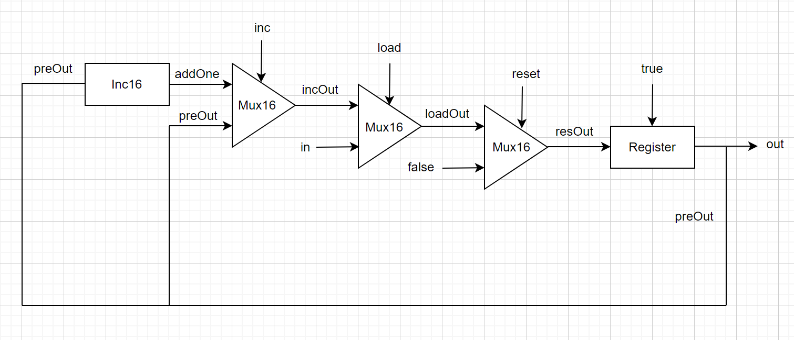

## 第三章 时序逻辑

### Bit

1 比特寄存器，具体的实现在书上 43 页已经给出，只要根据图示写出代码即可，注意 Mux 选择器，当 sel = 1 时输出的是 b

```hdl
/**
 * 1-bit register:
 * If load[t] == 1 then out[t+1] = in[t]
 *                 else out does not change (out[t+1] = out[t])
 */

CHIP Bit {
    IN in, load;
    OUT out;

    PARTS:
    // Put your code here:
    Mux(a=loop, b=in, sel=load, out=res);
    DFF(in=res, out=loop, out=out);
}
```


### Register

16 位的寄存器，直接由 16 个 1 比特的寄存器构成，每一个对应这输入，输出即可

```hdl
/**
 * 16-bit register:
 * If load[t] == 1 then out[t+1] = in[t]
 * else out does not change
 */

CHIP Register {
    IN in[16], load;
    OUT out[16];

    PARTS:
    // Put your code here:
    Bit(in=in[0], load=load, out=out[0]);
    Bit(in=in[1], load=load, out=out[1]);
    Bit(in=in[2], load=load, out=out[2]);
    Bit(in=in[3], load=load, out=out[3]);
    Bit(in=in[4], load=load, out=out[4]);
    Bit(in=in[5], load=load, out=out[5]);
    Bit(in=in[6], load=load, out=out[6]);
    Bit(in=in[7], load=load, out=out[7]);
    Bit(in=in[8], load=load, out=out[8]);
    Bit(in=in[9], load=load, out=out[9]);
    Bit(in=in[10], load=load, out=out[10]);
    Bit(in=in[11], load=load, out=out[11]);
    Bit(in=in[12], load=load, out=out[12]);
    Bit(in=in[13], load=load, out=out[13]);
    Bit(in=in[14], load=load, out=out[14]);
    Bit(in=in[15], load=load, out=out[15]);
}
```


### RAM8

8 - 寄存器，这个寄存器由 8 个 Register 构成，开始利用 address[3] 进行一个选择，之后再对每一个寄存器操作，将它们的输出值送到 RAM8 的 out 上

```hdl
CHIP RAM8 {
    IN in[16], load, address[3];
    OUT out[16];

    PARTS:
    // Put your code here:
    DMux8Way(in=load, sel=address, a=a, b=b, c=c, d=d, e=e, f=f, g=g, h=h);
    Register(in=in, load=a, out=outa);
    Register(in=in, load=b, out=outb);
    Register(in=in, load=c, out=outc);
    Register(in=in, load=d, out=outd);
    Register(in=in, load=e, out=oute);
    Register(in=in, load=f, out=outf);
    Register(in=in, load=g, out=outg);
    Register(in=in, load=h, out=outh);
    Mux8Way16(a=outa, b=outb, c=outc, d=outd, e=oute, f=outf, g=outg, h=outh, sel=address, out=out);
}
```


### RAM64

有了 RAM8 是实现，RAM64 利用同样的方法，只不过将每个寄存器改为 RAM8 就行了，要注意的是先用地址的前三位进行反向选择，然后后三位作为 RAM8 的 address

```hdl
CHIP RAM64 {
    IN in[16], load, address[6];
    OUT out[16];

    PARTS:
    // Put your code here:
    DMux8Way(in=load, sel=address[0..2], a=a, b=b, c=c, d=d, e=e, f=f, g=g, h=h);
    RAM8(in=in, load=a, address=address[3..5], out=outa);
    RAM8(in=in, load=b, address=address[3..5], out=outb);
    RAM8(in=in, load=c, address=address[3..5], out=outc);
    RAM8(in=in, load=d, address=address[3..5], out=outd);
    RAM8(in=in, load=e, address=address[3..5], out=oute);
    RAM8(in=in, load=f, address=address[3..5], out=outf);
    RAM8(in=in, load=g, address=address[3..5], out=outg);
    RAM8(in=in, load=h, address=address[3..5], out=outh);
    Mux8Way16(a=outa, b=outb, c=outc, d=outd, e=oute, f=outf, g=outg, h=outh, sel=address[0..2], out=out);
}
```

还有就是 RAM512，RAM4K，RAM16K 基本都是同样的思路，就不赘述了

### PC

这章最难实现的应该就是这个 PC 程序计数器了，主要是比较难想到，寄存器在内部的具体是如何连接的，这里参考了[woai3c/nand2tetris: 计算机系统要素-从零开始构建现代计算机](https://github.com/woai3c/nand2tetris) 大佬的思路

根据书上给的信息，reset = 1 时，会将输入置为 0，所以这个实现应该放在靠后的位置，直接置 0 ，不然放在前面，置 0 了后面没法操作；load = 1 的时候，会加载 in 的值；inc = 1 时，在上一个时刻的输出值加 1；画了一张示意图，可能不太标准，有了这个图，基本就是把对应的门电路实现一下即可



具体实现代码如下：

```hdl
CHIP PC {
    IN in[16],load,inc,reset;
    OUT out[16];

    PARTS:
    // Put your code here:
    
    //inc
    Inc16(in=preOut, out=addOne);
    Mux16(a=preOut, b=addOne, sel=inc, out=incOut);
    
    //load
    Mux16(a=incOut, b=in, sel=load, out=loadOut);

    //reset
    Mux16(a=loadOut, b=false, sel=reset, out=resOut);

    Register(in=resOut, load=true, out=preOut, out=out);
}

```

